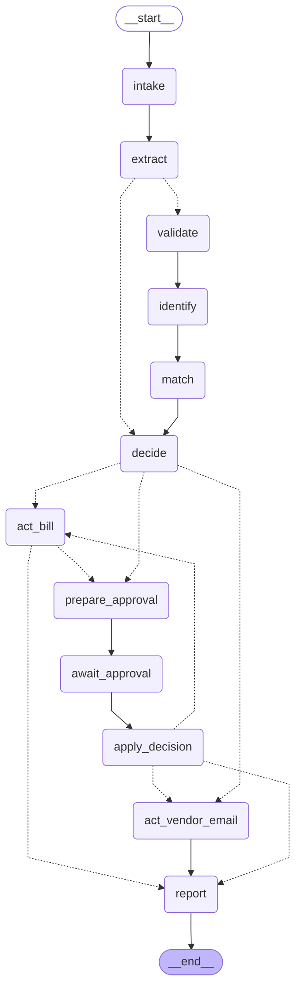

# Diagram graph faktur

Dibuat `npm run graph:diagram` dari graph yang dikompilasi; jangan disunting tangan.

```mermaid
---
config:
  flowchart:
    curve: linear
---
graph TD;
	__start__([<p>__start__</p>]):::first
	intake(intake)
	extract(extract)
	validate(validate)
	identify(identify)
	match(match)
	decide(decide)
	act_bill(act_bill)
	act_vendor_email(act_vendor_email)
	prepare_approval(prepare_approval)
	apply_decision(apply_decision)
	report(report)
	await_approval(await_approval)
	__end__([<p>__end__</p>]):::last
	__start__ --> intake;
	act_bill -.-> prepare_approval;
	act_bill -.-> report;
	act_vendor_email --> report;
	apply_decision -.-> act_bill;
	apply_decision -.-> act_vendor_email;
	apply_decision -.-> report;
	await_approval --> apply_decision;
	decide -.-> act_bill;
	decide -.-> act_vendor_email;
	decide -.-> prepare_approval;
	extract -.-> decide;
	extract -.-> validate;
	identify --> match;
	intake --> extract;
	match --> decide;
	prepare_approval --> await_approval;
	validate --> identify;
	report --> __end__;
	classDef default fill:#f2f0ff,line-height:1.2
	classDef first fill-opacity:0
	classDef last fill:#bfb6fc
```
